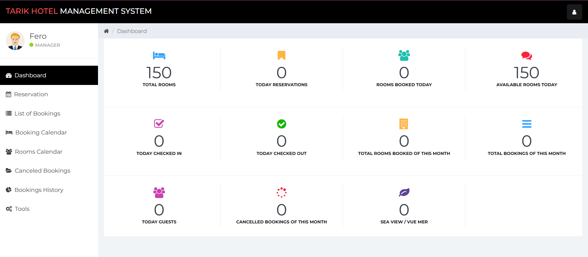

# 🏨 Hotel Tarek MS - Booking System

A **simple & cute Hotel Booking System** built with **PHP & MySQL**.  
This project is **local-only** (no API) and handles **CRUD operations**: add, update, delete, view bookings, with a login system for staff.  

---

## ✨ Features

- 📊 **Dashboard & Stats**:  
  Rooms available today, reserved rooms, check-ins & check-outs, total bookings & guests, canceled bookings.  

- 📝 **Booking Management**:  
  Add new bookings, view booking list, booking history, cancel bookings, and a **calendar view** of check-in/check-out dates.  

- 👤 **User Login**:  
  Staff can log in to manage bookings.  

- ✅ **Simple & Local**:  
  No external API required. Works perfectly on your local server (XAMPP, WAMP, MAMP, etc.)  

---

## 🗂 Project Structure
```
hotel-tarek-ms/
│ index.php
│ login.php
│ dashboard.php
│ reservation.php
│ reservationlist.php
│ canceled_reservations_list.php
│ booking_calendar.php
│ history_reservation.php
│ ...
├── counters/ (statistics files)
├── css/ (styles)
├── js/ (scripts)
├── img/ (images)
├── fonts/ (icon fonts)
└── database/ tarik_hotel_booking.sql
```

> All files are included — just upload the folder to your PC.

---

## ⚙ How to Run 🔧

1. **Upload the project folder** to your PC.  
2. **Import the SQL file**:  
   - Open **phpMyAdmin** (or any MySQL client)  
   - Create a database, e.g., `tarik_hotel_booking`  
   - Import `database/tarik_hotel_booking.sql`  
3. **Update database details**:  
   - Open `db.php`  
   - Enter your **local database username, password, and database name**  

```php
<?php
$connection = mysqli_connect("localhost","root","","tarik_hotel_booking");
?>
```
Run the project:

Start your local server

Open your browser: http://localhost/hotel-tarek-ms/

Login credentials:
```
Username: admin
Password: admin123
```
🎉 Now you can explore the dashboard, manage bookings, and enjoy the project!

## 🖼 Screenshot



💡 Notes

Works locally, no API needed

CRUD operations included

Sample data included for demonstration

📌 License

Open for personal learning and portfolio purposes
